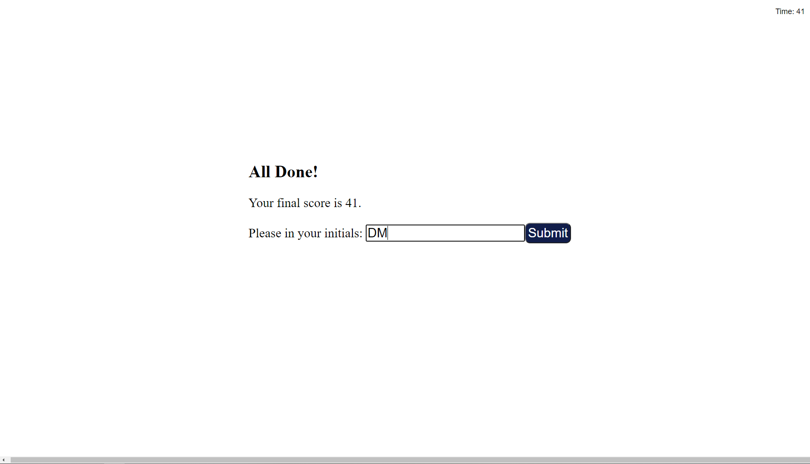

# code-quiz

## Description

### Purpose

The main purpose of this web page is to test the users knowledge of Javascript code.  The user hits the start button and is prompted to answer a set of questions one at a time in 60 seconds.  If they get the question correct, then they move on to the next one. If they get it wrong, their score/time is decreased by 10.  At the end they see their score and provide their initials, which are stored on the local storage and get a highscore board.

View webpage at: (https://duncanmarten.github.io/code-quiz/)

### Built With

* HTML
* CSS
* Javascript